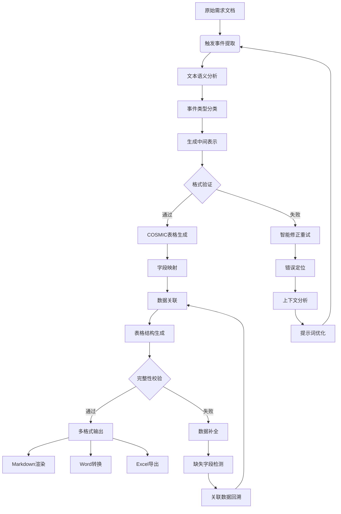
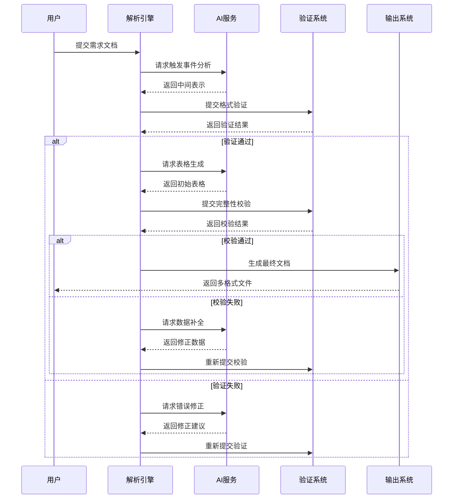
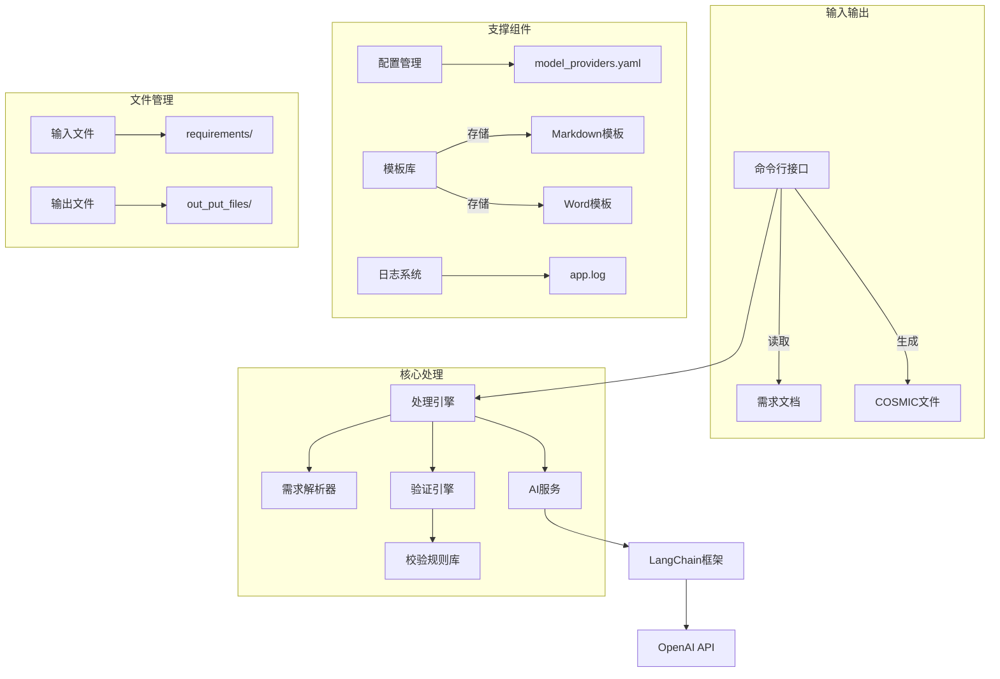

# 自动化COSMIC表格生成系统

## 项目概述
本系统采用Prompt工程+AI大模型，让AI大模型掌握COSMIC编写规则，结合Python校验引擎实现智能化需求处理。系统核心采用两阶段生成架构：第一阶段通过AI解析需求文档生成结构化触发事件和功能过程数据，第二阶段基于结构化数据分批生成最终COSMIC表格及配套解决方案文档。该设计有效突破大模型token限制，同时确保输出内容符合业务规范。

## 核心功能模块

### 1. 需求解析引擎
- 智能识别需求文档关键要素
- 动态提取表格行数要求
- 自动捕获需求名称和业务场景
- 支持最新文件自动检测与版本管理

### 2. AI集成与Prompt工程
- 定制化COSMIC规则Prompt模板库
- 多阶段提示词优化体系
- 动态上下文管理机制
- LangChain框架深度集成
- OpenAI API动态调用
- 智能对话历史管理（LRU缓存）
- 流式输出与实时回调机制
- 自动重试与退避策略（指数退避算法）

### 3. 分层处理架构
| **处理阶段**   | **输入**   | **输出**       | **解决的核心问题** |
|------------|----------|--------------|-------------|
| 触发事件生成     | 原始需求文档   | JSON结构化触发事件  | 突破模型token限制 |
| COSMIC表格生成 | 结构化触发事件  | 标准COSMIC表格   | 数据分块处理      |
| 解决方案文档生成   | COSMIC表格 | Word格式解决方案文档 | 结果可视化呈现     |

### 3. 数据处理核心


### 4. 处理时序流程


### 4. 验证系统
- JSON Schema严格校验
- 业务规则动态检查
- 跨字段关联验证
- 自动生成校验报告

### 5. 输出管理系统
- Markdown标准化输出
- 自动生成Word/Excel文档
- 版本化存储管理
- 临时文件自动清理

## 技术架构

### 系统架构


### 技术栈
- **核心语言**: Python
- **AI框架**: 
  - LangChain
  - OpenAI API
- **数据处理**: 
  - Pydantic v2 数据验证
  - JSON Schema
  - MinIO 本地存储
- **文件处理**:
  - Markdown生成
  - Word文档生成
  - 多格式导出
- **验证系统**:
  - cosmic文档规则校验
  - 智能语义验证
  - 自动化回归测试
- **配置管理**:
  - YAML配置文件
  - 动态模板加载

## 核心特性

### 1. 分层处理流程
1. **触发事件生成阶段**：
   - 基于prompt工程的规则注入
   - 业务触发点智能提取
   - 功能过程关系树构建
   - 生成标准JSON中间格式
   - 输出长度控制（≤800 tokens/批）
   - 结构化数据作为"需求大纲"缓存

2. **COSMIC表格生成阶段**：
   - 结构化数据分块处理（动态内存管理）
   - 滑动窗口批处理机制（5事件/批 ± 20%弹性）
   - 智能行数预测算法（±3%误差率）
   - 表格与解决方案文档协同生成
   - 多格式输出自动转换（MD/Word/Excel）
   - 文档合并与版本一致性校验

3. **校验反馈阶段**：
   - 实时双引擎校验：
     * Python规则引擎（300+校验规则）
     * AI语义一致性验证
   - 错误分级处理：
     1. 即时自动修正（语法错误）
     2. 带上下文反馈修正（逻辑错误）
     3. 人工介入处理（生成失败）
   - 修正记忆库构建
   - 多轮对话修正机制（最大3轮迭代）

### 2. 智能校验与修正
- 双引擎校验体系：
  - **Python规则引擎**：使用代码构建硬规则校验
  - **AI语义引擎**：上下文一致性验证
- 分级错误处理机制：
  1. 语法级错误：自动修正
  2. 逻辑级错误：AI建议修正
  3. 系统级错误：人工介入
- 动态上下文追溯：
  - 错误关联分析
  - 历史修正记录参考
  - 智能补全建议生成


## 文件结构
```
ai_exe_cosmic/
├── ai_common.py            # 通用AI组件
├── decorators.py           # 装饰器库
├── langchain_openai_client_v1.py  # AI服务适配层
├── validate_cosmic_table.py # 验证核心逻辑
├── configs/
│   └── model_providers.yaml # 模型配置
├── ai_promote/             # 业务模板库
├── requirements/           # 需求文档库
└── out_put_files/          # 多格式输出目录
```


----

## 使用指南

### 1. 环境配置
1. 在`configs/model_providers.yaml`配置模型供应商，支持：
   - OpenAI/GPT系列
   - 阿里云通义千问
   - 讯飞星火认知大模型
   - 本地私有化部署模型
2. 各厂商API_KEY需配置在系统环境变量：
   ```bash
   # Windows示例：
   setx OPENAI_API_KEY "sk-xxx"
   setx ALIYUN_API_KEY "ali-xxx"
   ```

### 2. 需求文档准备
1. 在`requirements/`目录新建txt文件
   2. 文件内容需包含：
   ```text
      1. 客户需求：$customer_requirements [用户提供的需求标题，必填]
      2. 需求背景：$background [需求的背景描述，必填]
      3. 详细方案：$detailed_plan  [需求的详细设计方案，必填]
      4. 功能用户：$functional_users  [发起者: [系统] 接收者：[系统]，必填]
      5. 功能用户需求: $functional_user_requirements  [用户输入的功能用户需求/没有可以不写]
      6. 表格总行数要求：$rows [例如：40行左右，必填]
    ```

### 3. 系统执行
```bash
# 完整执行流程（默认）
python main.py

# 分阶段执行
# 阶段1：生成触发事件JSON
python main.py --stage1

# 阶段2：生成COSMIC表格 
python main.py --stage2
```

### 4. 输出结果
1. 生成文件保存在`out_put_files/`目录
2. 包含以下文件：
   - `需求名称.xlsx`  cosmic表格
   - `需求名称.docx` Word解决方案文档
   - `需求名称.json`  一阶段AI输出JSON
   - `需求名称.md` 二阶段AI输出markdown格式的表格
   - `需求名称_resultcheck.txt` 校验报告
